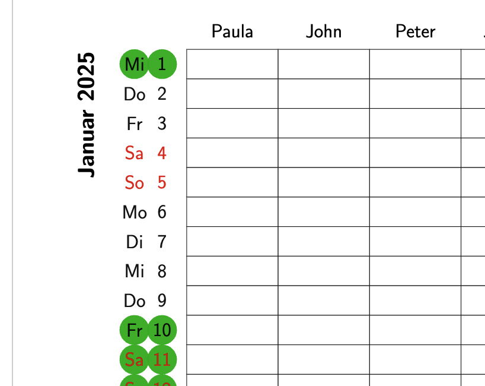

# famcal
A family calendar LaTeX package.

See the LICENSE file for the license details (Mozilla Public License Version 2.0).

## Manual

1. You need to edit in the document preable the variable \deffamilysize to match the number of people that want to use the calendar. 
2. Modify also in line 10 \defyear for the right year.
2. In line 21 you need to enter their names, separated by commas.
3. In lines 41-45 you need to enter vacation dates and specify in line 14 the correspondig colour.

Enjoy.

## Whishlist

1. Make adding vacations a bit more comfortable.
2. Colour / font themes?

## Screenshot
